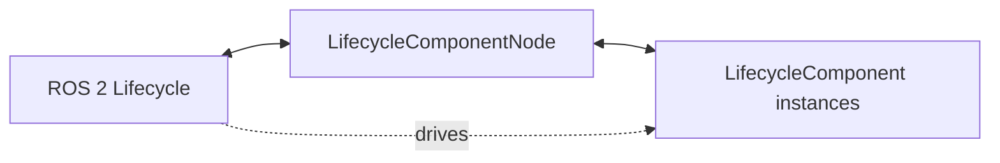

# lifecore_ros2


[](https://github.com/apajon/lifecore_ros2/actions/workflows/ci.yml) [](https://github.com/apajon/lifecore_ros2/actions/workflows/docs.yml) [](https://github.com/apajon/lifecore_ros2/actions/workflows/release.yml)
[](LICENSE) [](https://github.com/apajon/lifecore_ros2/releases/latest) [](https://pypi.org/project/lifecore-ros2/) [](https://pypi.org/project/lifecore-ros2/) [](https://apajon.github.io/lifecore_ros2/)

<!-- Canonical positioning sentence — keep in sync with pyproject.toml project.description. See CONTRIBUTING.md. -->
lifecore_ros2 is a minimal lifecycle composition library for ROS 2 Jazzy — no hidden state machine.

## Installation warning: ROS 2 Jazzy required

lifecore_ros2 requires a working ROS 2 Jazzy Python environment. Install and source ROS 2 before importing this package:

```bash
source /opt/ros/jazzy/setup.bash
uv add lifecore-ros2
```

`rclpy` comes from the system ROS installation. It is intentionally not declared as a normal PyPI dependency.


*The `examples/composed_pipeline.py` walk-through highlights the key distinction the library makes explicit: **deactivate ≠ cleanup** — `/pipeline/*` topics persist across deactivate and only disappear on cleanup.*

## Why lifecore_ros2 exists

**Audience.** This library is for teams building modular ROS 2 nodes that need reusable lifecycle-aware components, especially in larger robotics stacks, embedded systems, or runtime-orchestrated applications.

**Problem framing.** ROS 2 provides a powerful managed-node lifecycle (`configure → active → deactivate → cleanup`). In practice, using it for anything beyond a trivial node leads to recurring problems:

- lifecycle logic gets scattered across monolithic node classes with no clear ownership
- ROS resource setup and teardown (publishers, subscriptions, timers) are easy to make inconsistent — resources allocated in the wrong place or released too late
- runtime gating ("only process messages when active") is hand-rolled differently each time, with no shared, tested pattern
- reusable lifecycle-aware building blocks are awkward in raw `rclpy` because the lifecycle contract is on the node, not on reusable sub-units

lifecore_ros2 solves these four problems with a small, explicit composition layer. It does not replace or extend the ROS 2 lifecycle state machine — it makes the lifecycle contract expressible at the component level.

**Non-goals.** It is not a full application framework, not a plugin system, and not a replacement for native ROS 2 lifecycle semantics.

## Architecture at a glance



## What the library provides

A small set of lifecycle-aware building blocks:

| Symbol | Role |
|---|---|
| `LifecycleComponentNode` | Lifecycle node that owns and drives registered `LifecycleComponent` instances |
| `LifecycleComponent` | Base class for a lifecycle-aware managed entity (abstract by convention — override `_on_*` hooks) |
| `TopicComponent` | Base class for topic-oriented components (pub/sub) |
| `LifecyclePublisherComponent` | Lifecycle-gated ROS publisher |
| `LifecycleSubscriberComponent` | Lifecycle-gated ROS subscriber |
| `LifecycleTimerComponent` | Lifecycle-gated ROS timer |
| `ServiceComponent` | Base class for service-oriented components (server/client) |
| `LifecycleServiceServerComponent` | Lifecycle-gated ROS service server |
| `LifecycleServiceClientComponent` | Lifecycle-gated ROS service client |
| `when_active` | Decorator that guards any method to the active state |
| `LifecoreError` and subclasses | Typed exceptions for boundary violations |
| `lifecore_ros2.testing` | Reusable fakes, fixtures, assertions, and helpers for lifecycle-focused tests |

## Design rules and non-goals

The framework stays lifecycle-native, keeps ownership in `LifecycleComponentNode`, and treats component hooks as explicit extension points rather than hidden orchestration.

When sibling components need deterministic ordering, prefer declaring `dependencies` and `priority` at `add_component(...)` so composition intent stays visible in the node assembly code. [examples/composed_ordered_pipeline.py](examples/composed_ordered_pipeline.py) shows this pattern without constructor pass-through on framework components.

See [docs/architecture.rst](docs/architecture.rst) for lifecycle design rules, [docs/patterns.rst](docs/patterns.rst) for usage patterns, and [ROADMAP.md](ROADMAP.md) for non-goals and deferred scope.
See [Examples Repository Plan](docs/planning/examples_repo.rst) for the companion repository planning.
See [CHANGELOG.md](CHANGELOG.md) for shipped changes or the [GitHub Releases](https://github.com/apajon/lifecore_ros2/releases) page for tagged releases.

## Prerequisites

- Python 3.12 or newer
- ROS 2 Jazzy installed on the system
- `uv` available in the workspace

`rclpy` is expected to come from the system ROS installation. It is intentionally not declared as a normal PyPI dependency.

## Quickstart

Clone the repository, source ROS 2 Jazzy, and sync the local development environment:

```bash
git clone https://github.com/apajon/lifecore_ros2.git
cd lifecore_ros2
source /opt/ros/jazzy/setup.bash
uv sync --extra dev
```

Run the smallest composed lifecycle example already in the repository:

```bash
uv run python examples/minimal_node.py
```

From another terminal in the same ROS 2 environment, drive the node through configure and activate:

```bash
source /opt/ros/jazzy/setup.bash
ros2 lifecycle set /minimal_lifecore_node configure
ros2 lifecycle set /minimal_lifecore_node activate
```

For the full walkthrough, see [docs/quickstart.rst](docs/quickstart.rst). For validation and documentation commands, see [docs/getting_started.rst](docs/getting_started.rst). For the activation-gated subscriber example, continue with [examples/minimal_subscriber.py](examples/minimal_subscriber.py) or [docs/examples.rst](docs/examples.rst).

## Lifecycle reading path

The documentation now follows the same lifecycle vocabulary as the framework:

- Configure: environment, prerequisites, ROS resource creation model
- Activate: runtime enablement and activation gating
- Run: examples, API usage, composed execution flow
- Transition: ownership, propagation, and error handling rules
- Shutdown: cleanup, release, and lifecycle end-state expectations

Recommended order:

1. [docs/quickstart.rst](docs/quickstart.rst)
2. [docs/getting_started.rst](docs/getting_started.rst)
3. [docs/concepts/mental_model.rst](docs/concepts/mental_model.rst)
4. [docs/architecture.rst](docs/architecture.rst)
5. [docs/patterns.rst](docs/patterns.rst)
6. [docs/testing.rst](docs/testing.rst)
7. [docs/examples.rst](docs/examples.rst)

## Shortest-path example — subscriber

[examples/minimal_subscriber.py](examples/minimal_subscriber.py) is the next runnable example if you want to see activation-gated message delivery after the minimal node quickstart.

See [examples/minimal_subscriber.py](examples/minimal_subscriber.py) for the complete runnable file, [docs/api_friction_audit.rst](docs/api_friction_audit.rst) for the regression baseline, and [docs/examples.rst](docs/examples.rst) for the walkthrough.

> Component + node definition: **24 lines** (regression baseline — see
> [`docs/api_friction_audit.rst`](docs/api_friction_audit.rst)).

## Publisher and subscriber examples

Run the publisher and observe activation gating:

```bash
uv run python examples/minimal_publisher.py
# in another terminal:
ros2 lifecycle set /publisher_demo_node configure
ros2 lifecycle set /publisher_demo_node activate
ros2 topic echo /chatter
```

Messages appear only after `activate`. Deactivation stops them.

For the subscriber path, use the quickstart above or the full example walkthrough in [docs/examples.rst](docs/examples.rst).

## Public API overview

All exported symbols and their stability levels are documented in [ROADMAP.md](ROADMAP.md#public-api-and-extension-model).

The extension model and API buckets are defined in [docs/architecture.rst](docs/architecture.rst) and [docs/api.rst](docs/api.rst).

## Current limitations

- package metadata uses `Development Status :: 3 - Alpha` to reflect API stability, not lack of usability
- the public API is in the `0.x` series — experimental stability level; minor bumps may include breaking changes
- companion examples live in [`lifecore_ros2_examples`](https://github.com/apajon/lifecore_ros2_examples); start with the [`sensor watchdog lifecycle comparison`](https://github.com/apajon/lifecore_ros2_examples/blob/main/examples/lifecycle_comparison/README.md) for the first applied example, then see `ROADMAP.md` there for future scenarios

## License

This project is licensed under the Apache-2.0 License — see [LICENSE](LICENSE).

## Documentation

Documentation: https://apajon.github.io/lifecore_ros2/

Full documentation lives under `docs/` and is built with Sphinx:

```bash
uv sync --extra dev --group docs
uv run --group docs python -m sphinx -b html docs docs/_build/html
```

Key pages:
- `docs/getting_started.rst` — setup and validation commands
- `docs/architecture.rst` — lifecycle design rules, error policy, member conventions
- `docs/patterns.rst` — recommended patterns and anti-patterns
- `docs/testing.rst` — reusable lifecycle test fakes, fixtures, assertions, and helpers
- `docs/migration_from_rclpy.rst` — before/after comparison with raw rclpy
- `docs/api.rst` — generated API reference
- `docs/examples.rst` — example walkthroughs

## Versioning

Versioning uses Conventional Commits and python-semantic-release. Preview the next version:

```bash
uv run --group release semantic-release version --print
```

Release (version commit + tag, skip hosted release if no token):

```bash
uv run --group release semantic-release version --no-vcs-release
git push origin main --follow-tags
```

See [ROADMAP.md](ROADMAP.md#versioning-strategy) for promotion-to-1.0.0 criteria.
